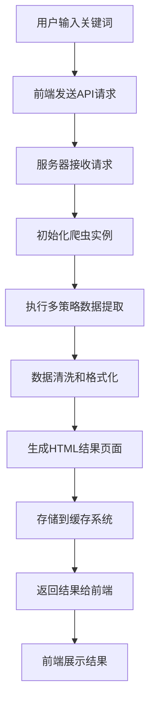

# 小红书搜索工具 - 技术文档

> **声明**: 本项目仅供学习研究使用，请遵守小红书平台的相关条款和法律法规。

## 📖 项目概述

小红书搜索工具是一个基于Python + Selenium的Web应用，提供小红书内容搜索、结果展示和数据分析功能。项目采用现代化的前后端分离架构，具有良好的可扩展性和可维护性。

### 🎯 核心特性

- **🔍 智能搜索**: 多策略数据提取，确保搜索结果的准确性和完整性
- **📱 现代化界面**: 响应式Web设计，支持桌面和移动端访问
- **⚡ 高性能缓存**: 双重缓存机制（内存+文件），提升响应速度
- **🛡️ 反爬保护**: 集成多种反爬虫策略，提高系统稳定性
- **📊 结果展示**: 自动生成美观的HTML结果页面
- **🔄 智能重试**: 自动错误恢复和重试机制

### 🏗️ 技术架构

```
┌─────────────────┐    ┌─────────────────┐    ┌─────────────────┐
│   前端 (Web)    │────│   服务器 (API)  │────│   爬虫 (Core)   │
│                 │    │                 │    │                 │
│ • HTML/CSS/JS   │    │ • Flask框架     │    │ • Selenium      │
│ • 响应式设计    │◄───│ • RESTful API   │◄───│ • Chrome驱动    │
│ • 异步请求      │    │ • 缓存管理      │    │ • 多策略提取    │
└─────────────────┘    └─────────────────┘    └─────────────────┘
         │                       │                       │
         ▼                       ▼                       ▼
┌─────────────────┐    ┌─────────────────┐    ┌─────────────────┐
│   用户界面      │    │   数据处理      │    │   数据采集      │
│                 │    │                 │    │                 │
│ • 搜索输入      │    │ • JSON序列化    │    │ • 页面解析      │
│ • 结果展示      │    │ • HTML生成      │    │ • 反爬处理      │
│ • 交互反馈      │    │ • 错误处理      │    │ • 数据清洗      │
└─────────────────┘    └─────────────────┘    └─────────────────┘
```

## 🚀 快速开始

### 环境要求

#### 系统要求
- **操作系统**: macOS 10.14+, Ubuntu 18.04+, Windows 10+
- **内存**: 最低4GB，推荐8GB以上
- **硬盘**: 至少1GB可用空间

#### 软件依赖
- **Python**: 3.8+ (推荐3.9或3.10)
- **Chrome浏览器**: 最新稳定版本
- **Git**: 用于代码版本管理

### 安装步骤

#### 1. 获取源码
```bash
# 克隆项目仓库
git clone <repository-url>
cd xiaohongshu-search
```

#### 2. 环境配置
```bash
# 创建虚拟环境 (推荐)
python3 -m venv venv
source venv/bin/activate  # Linux/macOS
# venv\Scripts\activate   # Windows

# 安装依赖包
pip install -r requirements.txt
```

#### 3. 启动应用
```bash
# 运行主程序
python3 app.py
```

启动成功后，访问 http://localhost:8080

### Docker部署（可选）

```bash
# 构建镜像
docker build -t xiaohongshu-search .

# 运行容器
docker run -p 8080:8080 xiaohongshu-search
```

## 📁 项目结构详解

```
xiaohongshu-search/                 # 项目根目录
├── app.py                         # 🚀 主启动文件
├── requirements.txt               # 📦 Python依赖清单
├── 
├── config/                        # ⚙️ 配置管理
│   └── config.py                 # 全局配置文件
├── 
├── src/                          # 💻 核心源码
│   ├── crawler/                  # 🕷️ 爬虫模块
│   │   └── xiaohongshu_crawler.py # 小红书爬虫核心
│   ├── server/                   # 🌐 服务器模块
│   │   └── main_server.py        # Flask Web服务器
│   └── utils/                    # 🔧 工具函数
│       └── common.py             # 通用工具
├── 
├── static/                       # 🎨 前端资源
│   ├── index.html               # 主页面
│   ├── css/                     # 样式文件
│   │   └── style.css            # 主样式表
│   ├── js/                      # JavaScript文件
│   │   ├── api.js              # API客户端
│   │   └── script.js           # 主要逻辑
│   └── images/                  # 图片资源
│       └── logo.png             # 应用Logo
├── 
├── cache/                        # 💾 缓存目录
│   ├── cookies/                 # Cookie存储
│   ├── logs/                    # 运行日志
│   ├── results/                 # 搜索结果HTML
│   └── temp/                    # 临时文件
├── 
├── drivers/                      # 🚗 WebDriver
│   └── chromedriver-mac-arm64/   # Chrome驱动(macOS ARM64)
├── 
├── docs/                         # 📚 项目文档
│   ├── README.md                # 技术文档(本文件)
│   ├── UPDATE_LOG.md            # 更新日志
│   ├── API.md                   # API接口文档
│   └── DEPLOYMENT.md            # 部署指南
└── 
└── scripts/                      # 📜 工具脚本
    ├── setup.sh                 # 环境配置脚本
    └── deploy.sh                # 部署脚本
```

## ⚙️ 配置说明

### 主配置文件 (`config/config.py`)

项目使用统一的配置管理系统，所有配置项都在`config/config.py`中定义：

```python
# 应用基础配置
APP_CONFIG = {
    'HOST': '0.0.0.0',          # 服务器监听地址
    'PORT': 8080,               # 服务器端口
    'DEBUG': False              # 调试模式
}

# 搜索功能配置
SEARCH_CONFIG = {
    'DEFAULT_MAX_RESULTS': 21,   # 默认搜索结果数量
    'CACHE_ENABLED': True,       # 是否启用缓存
    'CACHE_TTL': 3600           # 缓存有效期(秒)
}

# 爬虫引擎配置
CRAWLER_CONFIG = {
    'USE_SELENIUM': True,        # 使用Selenium
    'HEADLESS': True,           # 无头模式
    'WINDOW_SIZE': (1920, 1080), # 浏览器窗口大小
    'PAGE_LOAD_TIMEOUT': 30,     # 页面加载超时
    'IMPLICIT_WAIT': 10         # 隐式等待时间
}
```

### 环境变量配置

```bash
# 设置环境变量
export XIAOHONGSHU_HOST=0.0.0.0
export XIAOHONGSHU_PORT=8080
export XIAOHONGSHU_DEBUG=False
export CHROME_DRIVER_PATH=/path/to/chromedriver
```

## 🔌 API接口文档

### 基础信息
- **Base URL**: `http://localhost:8080/api`
- **数据格式**: JSON
- **字符编码**: UTF-8

### 接口列表

#### 1. 搜索笔记
```http
GET /api/search?keyword={keyword}&max_results={number}&use_cache={boolean}
```

**参数说明**:
- `keyword` (必需): 搜索关键词
- `max_results` (可选): 最大结果数，默认21
- `use_cache` (可选): 是否使用缓存，默认true

**响应示例**:
```json
{
    "keyword": "化妆品",
    "timestamp": 1701234567,
    "count": 15,
    "notes": [...],
    "html_url": "/results/search_abc123.html",
    "html_api_url": "/api/result-html/abc123"
}
```

#### 2. 获取笔记详情
```http
GET /api/note/{note_id}
```

**参数说明**:
- `note_id` (必需): 笔记ID

**响应示例**:
```json
{
    "note": {
        "id": "64f1a2b3c4d5e6f7",
        "title": "秋季护肤攻略",
        "author": "美妆达人",
        "content": "...",
        "likes": 1234,
        "comments": 56
    }
}
```

#### 3. 获取热门关键词
```http
GET /api/hot-keywords
```

**响应示例**:
```json
{
    "keywords": ["口红", "护肤品", "连衣裙", "耳机", "咖啡"]
}
```

#### 4. 获取HTML结果页面
```http
GET /api/result-html/{html_hash}
```

**参数说明**:
- `html_hash` (必需): HTML内容的MD5哈希值

**响应**: HTML页面内容

### 错误响应格式
```json
{
    "error": "错误描述",
    "message": "详细错误信息",
    "code": 400
}
```

## 🛠️ 开发指南

### 代码结构说明

#### 1. 后端架构
```python
# Flask应用主体
app = Flask(__name__, static_folder='../../static')

# 核心路由组织
@app.route('/')                    # 主页
@app.route('/api/search')          # 搜索API
@app.route('/api/note/<note_id>')  # 笔记详情API
@app.route('/login')               # 用户登录
```

#### 2. 爬虫引擎
```python
class XiaoHongShuCrawler:
    """小红书爬虫核心类"""
    
    def __init__(self, use_selenium=True, headless=True):
        # 初始化WebDriver和配置
        
    def search(self, keyword, max_results=21):
        # 执行搜索，使用多策略数据提取
        
    def _extract_notes_with_strategies(self):
        # 策略1: 直接链接提取
        # 策略2: 元素遍历提取  
        # 策略3: 关键词匹配提取
```

#### 3. 前端架构
```javascript
// API客户端 (api.js)
async function getRedBookNotes(keyword, options = {}) {
    // 发送搜索请求
}

// 主要逻辑 (script.js)
document.addEventListener('DOMContentLoaded', function() {
    // DOM操作和事件绑定
});
```

### 数据流程



### 扩展开发

#### 添加新的搜索策略
```python
def _extract_strategy_4(self):
    """新的数据提取策略"""
    try:
        # 实现新的提取逻辑
        elements = self.driver.find_elements(By.CSS_SELECTOR, '.new-selector')
        # 处理元素...
        return extracted_notes
    except Exception as e:
        logger.error(f"策略4执行失败: {str(e)}")
        return []
```

#### 添加新的API端点
```python
@app.route('/api/new-endpoint')
def new_endpoint():
    """新的API端点"""
    try:
        # 处理逻辑
        return jsonify({"result": "success"})
    except Exception as e:
        return jsonify({"error": str(e)}), 500
```

## 🐛 故障排除

### 常见问题及解决方案

#### 1. ChromeDriver相关问题

**问题**: ChromeDriver版本不匹配
```bash
SessionNotCreatedException: Message: session not created: This version of ChromeDriver only supports Chrome version XX
```

**解决方案**:
```bash
# 查看Chrome版本
google-chrome --version

# 下载对应版本的ChromeDriver
# https://chromedriver.chromium.org/downloads

# 替换drivers目录中的文件
cp chromedriver drivers/chromedriver-mac-arm64/
chmod +x drivers/chromedriver-mac-arm64/chromedriver
```

#### 2. 端口占用问题

**问题**: 端口8080被占用
```bash
Address already in use
```

**解决方案**:
```bash
# 查找占用进程
lsof -i :8080

# 终止进程
kill -9 <PID>

# 或者更改端口配置
export XIAOHONGSHU_PORT=8081
```

#### 3. 搜索结果为空

**问题**: 搜索返回空结果

**解决方案**:
1. 检查网络连接
2. 清理浏览器缓存: `rm -rf cache/temp/*`
3. 手动登录: 访问 `http://localhost:8080/login`
4. 检查Chrome浏览器是否正常工作

#### 4. 内存不足

**问题**: 系统内存不足导致程序崩溃

**解决方案**:
```python
# 在config/config.py中调整配置
CRAWLER_CONFIG = {
    'CHROME_OPTIONS': [
        '--memory-pressure-off',
        '--max_old_space_size=4096',
        '--disable-dev-shm-usage'
    ]
}
```

#### 5. 页面加载超时

**问题**: 页面加载时间过长

**解决方案**:
```python
# 增加超时时间
CRAWLER_CONFIG = {
    'PAGE_LOAD_TIMEOUT': 60,  # 增加到60秒
    'IMPLICIT_WAIT': 15       # 增加隐式等待
}
```

### 日志分析

#### 查看实时日志
```bash
# 查看最新日志
tail -f cache/logs/app.log

# 查看错误日志
grep "ERROR" cache/logs/app.log

# 查看特定时间的日志
grep "2024-01-15" cache/logs/app.log
```

#### 日志级别配置
```python
import logging

# 设置不同的日志级别
logging.basicConfig(
    level=logging.DEBUG,  # DEBUG, INFO, WARNING, ERROR, CRITICAL
    format='%(asctime)s - %(name)s - %(levelname)s - %(message)s'
)
```

## 🔒 安全注意事项

### 数据安全
- 本地存储的Cookie文件包含敏感信息，请妥善保管
- 定期清理缓存目录，避免敏感数据泄露
- 不要在生产环境中启用DEBUG模式

### 使用合规
- 遵守小红书平台的robots.txt规则
- 控制请求频率，避免对服务器造成过大负担
- 仅用于学习研究目的，禁止商业用途

### 隐私保护
- 不收集、存储或传输用户个人信息
- 搜索结果仅在本地处理和展示
- 支持一键清理所有缓存数据

## 📈 性能优化

### 缓存策略
```python
# 多层缓存架构
1. 内存缓存 (html_results_cache) - 热点数据，毫秒级访问
2. 文件缓存 (cache/results/) - 持久化存储，秒级访问
3. 数据库缓存 (可选) - 大规模数据，分钟级访问
```

### 并发处理
```python
# 使用线程池处理并发请求
from concurrent.futures import ThreadPoolExecutor

def process_multiple_keywords(keywords):
    with ThreadPoolExecutor(max_workers=3) as executor:
        futures = [executor.submit(search_keyword, kw) for kw in keywords]
        results = [future.result() for future in futures]
    return results
```

### 资源监控
```bash
# 监控系统资源
top -p $(pgrep -f "python3 app.py")

# 监控内存使用
ps aux | grep "python3 app.py"

# 监控磁盘空间
du -sh cache/
```

## 🤝 贡献指南

### 开发环境设置
```bash
# 克隆开发分支
git clone -b develop <repository-url>

# 安装开发依赖
pip install -r requirements-dev.txt

# 运行测试
python -m pytest tests/

# 代码格式化
black src/
flake8 src/
```

### 提交规范
```bash
# 提交格式
git commit -m "类型(范围): 简短描述

详细描述

相关Issue: #123"

# 提交类型
feat: 新功能
fix: 错误修复
docs: 文档更新
style: 代码格式
refactor: 代码重构
test: 测试相关
chore: 构建/工具相关
```

### Pull Request流程
1. Fork项目到个人仓库
2. 创建功能分支: `git checkout -b feature/new-feature`
3. 提交更改: `git commit -am 'Add new feature'`
4. 推送分支: `git push origin feature/new-feature`
5. 创建Pull Request

## 📞 支持与反馈

### 获取帮助
- **GitHub Issues**: 报告Bug和功能请求
- **项目文档**: 查看详细技术文档
- **社区讨论**: 参与项目讨论

### 联系方式
- **项目主页**: https://github.com/username/xiaohongshu-search
- **技术文档**: https://username.github.io/xiaohongshu-search
- **更新日志**: 查看 `docs/UPDATE_LOG.md`

### 版本支持
- **当前版本**: v2.0.0
- **支持周期**: 长期支持(LTS)
- **更新频率**: 每月发布稳定版本

---

## 📄 许可证

本项目基于 MIT 许可证开源，详情请查看 [LICENSE](../LICENSE) 文件。

**⚠️ 重要提醒**: 
- 本工具仅供学习研究使用
- 请遵守小红书平台服务条款
- 请遵守当地法律法规
- 禁止用于商业目的或大规模数据采集

---

*最后更新: 2025年6月3日* 